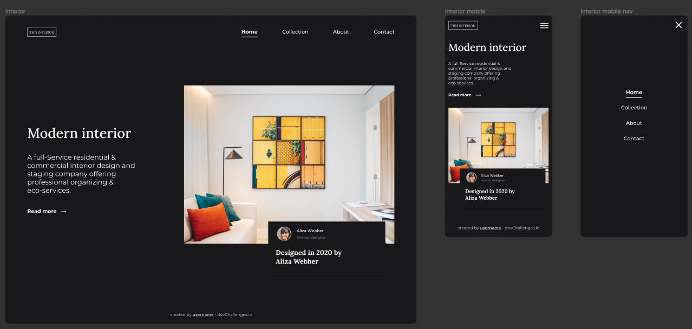
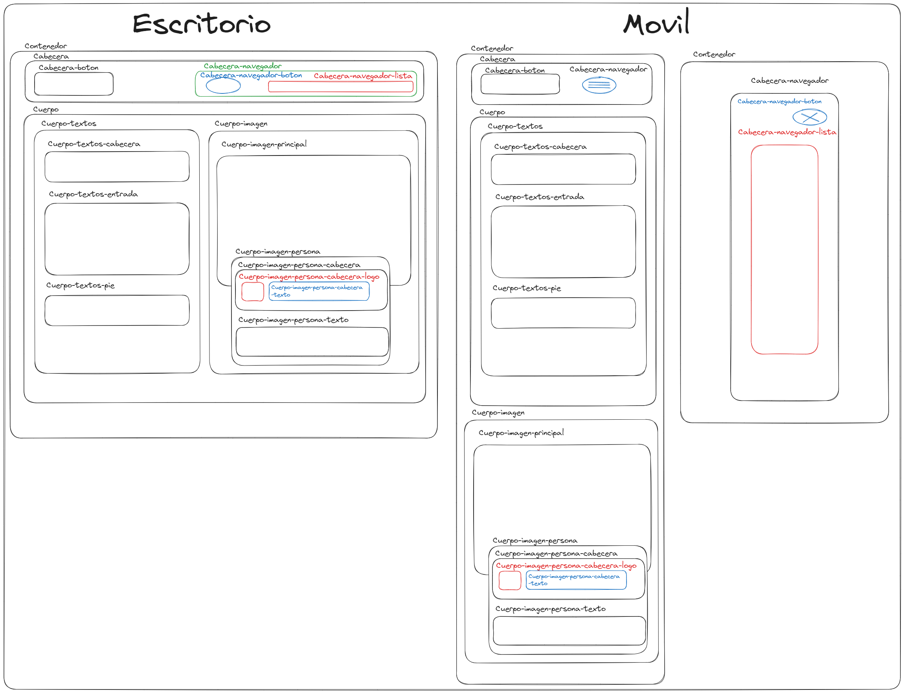

<!-- Please update value in the {}  -->

<h1 align="center">Interior consultant master</h1>

   Soluición al reto de  <a href="http://devchallenges.io" target="_blank">Devchallenges.io</a>.

  <h3>
    <a href="https://{your-demo-link.your-domain}">
      Demo
    </a>
     | 
    <a href="https://{your-url-to-the-solution}">
      Solución
    </a>
     | 
    <a href="https://devchallenges.io/challenges/Jymh2b2FyebRTUljkNcb">
      Reto
    </a>
  </h3>

<!-- TABLE OF CONTENTS -->

## Table of Contents

- [Descripción general](#overview)
  - [Construido Con](#built-with)
- [Características](#features)
- [Contacto](#contact)
- [Agradecimientos](#acknowledgements)

<!-- OVERVIEW -->

## Overview
## Descripción general

En figma está el proyecto

Para tener una idea de cómo debería estar las clases y los nombres que les voy a dar, he creado el siguiente esquema:

Presente sus proyectos tomando una captura de pantalla o un gif. Intente contarles a los visitantes una historia sobre su proyecto respondiendo:

- ¿Dónde puedo ver tu demo?
- ¿Cuál fue tu experiencia?
- ¿Qué has aprendido/mejorado?
- ¿Tu sabiduría? :)

### Built With

<!-- This section should list any major frameworks that you built your project using. Here are a few examples.-->

- HTML
- CSS
- JavaScript

## Features

<!-- List the features of your application or follow the template. Don't share the figma file here :) -->

Esta aplicación/sitio se creó como envío a un desafío [DevChallenges](https://devchallenges.io/challenges). El [desafío](https://devchallenges.io/challenges/Jymh2b2FyebRTUljkNcb) fue crear una aplicación para completar las historias de usuario dadas.
## Acknowledgements

<!-- This section should list any articles or add-ons/plugins that helps you to complete the project. This is optional but it will help you in the future. For exmpale -->

- [Steps to replicate a design with only HTML and CSS](https://devchallenges-blogs.web.app/how-to-replicate-design/)
- [Node.js](https://nodejs.org/)
- [Marked - a markdown parser](https://github.com/chjj/marked)

## Contact

- Website [oswaldo.dev](https://oswaldo.dev)
- GitHub [@OswaldoDomingo](https://github.com/OswaldoDomingo)

