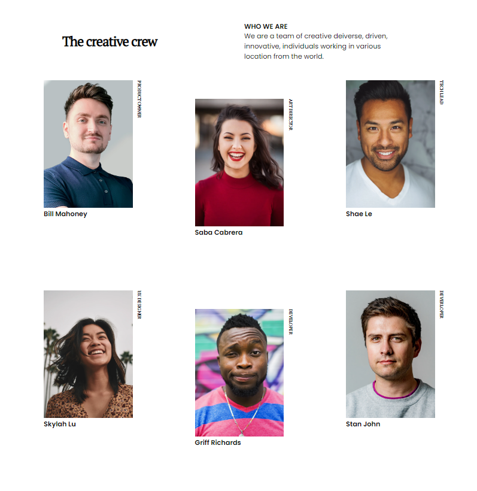
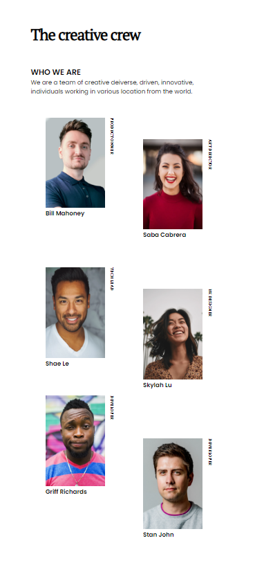

<!-- Please update value in the {}  -->

<h1 align="center">{Target team}</h1>

   Solution for a challenge from  <a href="http://devchallenges.io" target="_blank">Devchallenges.io</a>.

  <h3>
    <a href="https://oswaldo.dev/portafolio/team-page/">
      Demo
    </a>
     | 
    <a href="https://oswaldo.dev/portafolio/team-page/">
      Solution
    </a>
     | 
    <a href="https://devchallenges.io/challenges/hhmesazsqgKXrTkYkt0U">
      Challenge
    </a>
  </h3>

<!-- TABLE OF CONTENTS -->

## Table of Contents
### tabla de contenidos o índice será, ¿no?

- [Overview](#overview)
  - [Built With](#built-with)
- [Features](#features)
- [Contact](#contact)
- [Acknowledgements](#acknowledgements)
- [Recursos](#recursos)
<!-- OVERVIEW -->

## Overview
### Descripción general

Presente sus proyectos tomando una captura de pantalla o un gif. Intente contarles a los visitantes una historia sobre su proyecto respondiendo:

- ¿Dónde puedo ver tu demo?
  - [Página](https://oswaldo.dev/portafolio/team-page/)
- ¿Cuál fue tu experiencia?
  - Me está costando mucho la segunda columna que quede más baja que las otras dos, luego hay que hacer que se adapte a la versión movil. 
  He usado combinación de flex y grid.
- ¿Qué has aprendido/mejorado?
  - Estoy mirando el grid en vez de usar flex pero combiné los dos
- ¿Tu sabiduría? :)
  - Que se cada vez menos :'( pero voy aprendiendo cada día más.

## Built With
### Herramientas que he usado

<!-- Esta sección debe enumerar los principales marcos de trabajo con los que creó su proyecto. Aquí hay algunos ejemplos.

- [React](https://reactjs.org/)
- [Vue.js](https://vuejs.org/)
- [Tailwind](https://tailwindcss.com/)
-->
CSS
HTML

## Recursos
<!-- Esta sección pongo donde he sacado información para resolver el reto.-->
[CSS Grid | Introducción Práctica desde Cero](https://www.youtube.com/watch?v=QBOUSrMqlSQ&t=498s&ab_channel=FaztCode)
[Aprende CSS de Google, la parte de grid](https://web.dev/learn/css/grid/)

## Features
### Características

<!-- Enumere las características de su aplicación o siga la plantilla. No compartas el archivo figma aquí :) -->

Esta aplicación/sitio se creó como envío a un desafío [DevChallenges](https://devchallenges.io/challenges). El [desafío](https://devchallenges.io/challenges/hhmesazsqgKXrTkYkt0U) fue crear una aplicación para completar las historias de usuario dadas.

## Acknowledgements
### Agradecimientos

<!-- Esta sección debe enumerar cualquier artículo o complemento/complemento que lo ayude a completar el proyecto. Esto es opcional pero te ayudará en el futuro. Por ejemplo -->

- [Pasos para replicar un diseño solo con HTML y CSS](https://devchallenges-blogs.web.app/how-to-replicate-design/)
- [Node.js](https://nodejs.org/)
- [Marcado - un analizador de rebajas](https://github.com/chjj/marked)

## Contact

- Website [oswaldo.dev](https://www.oswaldo.dev)
- GitHub [@your-username](https://github.com/OswaldoDomingo)